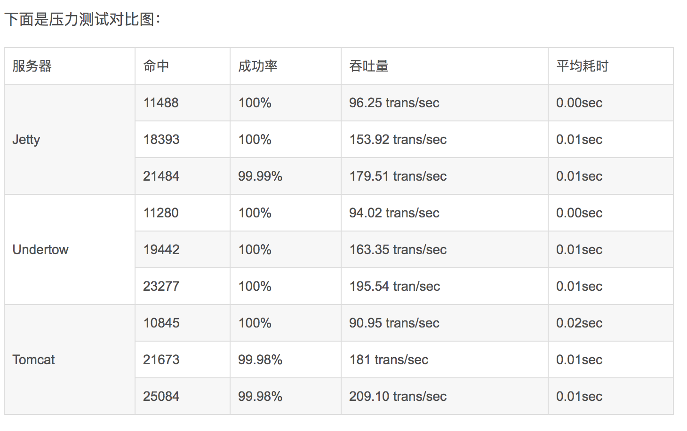

# undertow
```text
    undertow,jetty和tomcat可以说是javaweb项目当下最火的三款服务器，tomcat是apache下的一款重量级的服务器，不用多说历史悠久，经得起实践的考验。
然而：当下微服务兴起，spring boot ，spring cloud 越来越热的情况下，选择一款轻量级而性能优越的服务器是必要的选择。spring boot 完美集成了tomcat，
jetty和undertow，本文将通过对jetty和undertow服务器的分析以及测试，来比较两款服务器的性能如何。
    值得一提的是jetty和undertow都是基于NIO实现的高并发轻量级的服务器，支持servlet3.1和websocket。所以，有必要先了解下什么是NIO。
```
